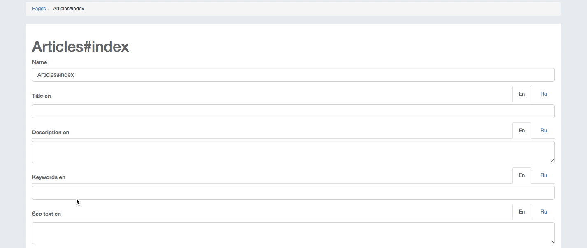

# Seo

This gem provides a web interface for managing SEO information for each of your page, post, etc...

####It allows:

* Automatically add 'title', 'description', 'keywords' to pages
* Managing 'seo_text' in views

### Dependecy
```ruby
  gem 'multilang_field', github: 'kelevro/multilang_field'
  gem 'slim'
  gem 'meta-tags'
```

### Install
```ruby
  gem 'seo', github: 'kelevro/seo'
```

### Migrations
```console
  rake seo:install:migrations
  rake db:migrate
```

### Routes
```ruby
  mount Seo::Engine => '/seo'
```

###Controller
```ruby
class ArticlesController < ApplicationController
  enable_seo only: [:index]
  ...
end
```

### Assign to model
For example Article model

```ruby
  add_seo :articles, :show, :id
```

`:articles` - controller name
`:show` - action name
`:id` - param name

If you need validation to seo data

```ruby
  add_seo :articles, :show, :id do
    validates :title, :description, presence: true
  end
```

### Layouts
in `<head>` add:

```ruby
<%= header_meta_tags %>
```

###Accsess
```ruby
can :update, :seo_pages
can :destroy	, :seo_pages
```
### Usage



####Example add to seo Articles:

```ruby
Rails.application.routes.draw do
  ...
  resources :articles do
    get :seo, on: :member
    patch :update_seo, on: :member
  end
  ...
end
```
```ruby
class ArticlesController < ApplicationController
	...
	def seo
		@article = Article.find(params[:id])
		load_seo(@article)
	end

	def update_seo
		@article = Article.find(params[:id])
		if @article.update(seo_params(@article.class))
		  flash[:success] = 'Seo updated successfully'
		  redirect_to action: :seo
		else
		  render 'seo'
		end
  	end

	private
	def seo_params(class_name)
       params
       .require(class_name.to_s.underscore.to_sym)
       .permit(seo_records_attributes: build_seo_params)
  	end
	...
end
```
In view

```erb
<%= render 'seo/form',
	model:      @article,
	form_url:   update_seo_article_path(@article),
	action_url: :seo_article_path,
	actions:    @article.seo_records.map(&:action) %>
```
Partial:

```ruby
 <%= simple_form_for model, url: form_url, validate: true do |f| %>
  <div class="btn-group">
    <% if actions.count > 1 %>
      <% actions.each do |action| %>
        <a href="<%= send(action_url, model.id, seo_action: action) %>"
           class="btn btn-default <%= 'active' if @seo.action == action %>">
          <%= "#{action.capitalize} page" %>
        </a>
      <% end %>
    <% end %>
  </div>

  <%= f.simple_fields_for :seo_records, @seo do |seo_form| %>
    <%= multilang_wrapper(:title) { |attribute| seo_form.input attribute } %>
    <%= multilang_wrapper(:description) { |attribute| seo_form.input attribute, as: :text } %>
    <%= multilang_wrapper(:keywords) { |attribute| seo_form.input attribute } %>
    <%= multilang_wrapper(:seo_text) { |attribute| seo_form.input attribute, as: :text, input_html: { rows: 10 } } %>
    <%= seo_form.input :action, as: :hidden %>
    <%= f.submit 'Save', class: 'btn btn-success col-sm-offset-2 col-sm-2' %>
  <% end %>
<% end %>
```
